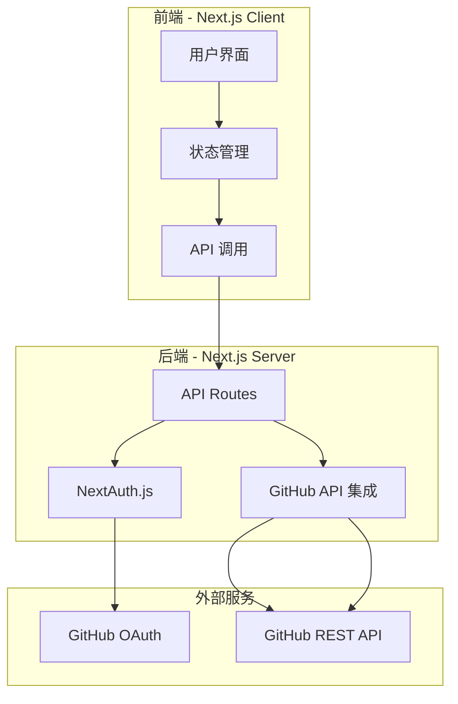
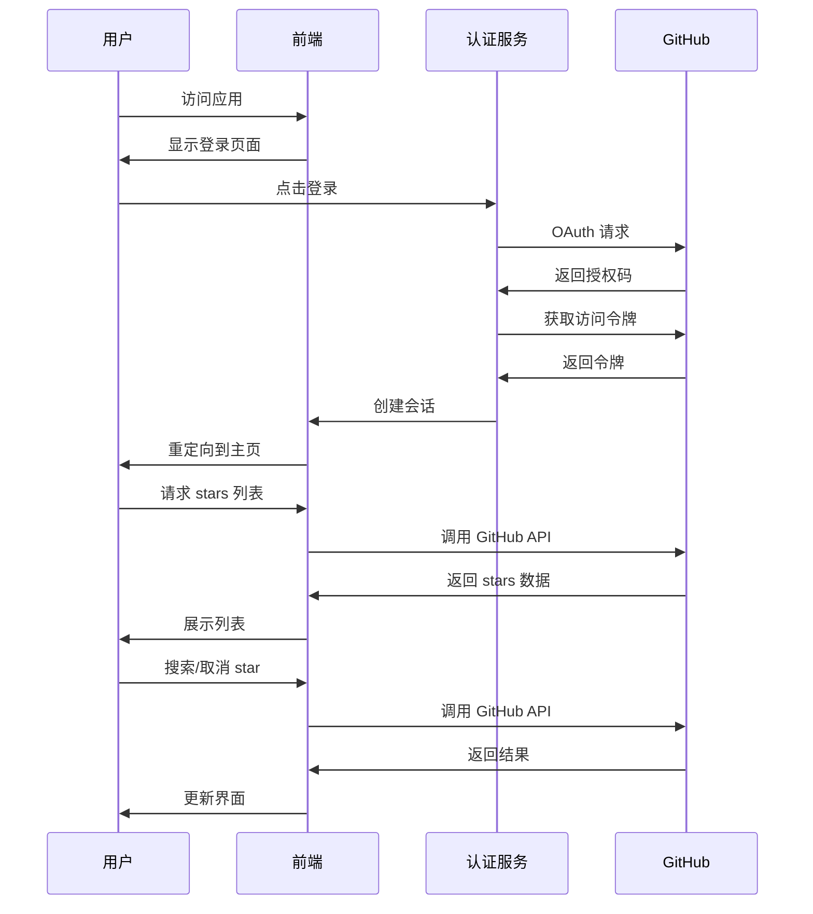

# GitHub Stars 展示网站 - 实施计划

## 项目概述

创建一个全栈 Web 应用，允许用户通过 GitHub OAuth 登录后，查看和管理自己的 GitHub stars，包括搜索、取消 star 以及查看仓库详细信息。

## 技术栈

- **前端框架**: Next.js 14+ (App Router)
- **编程语言**: TypeScript
- **样式方案**: Tailwind CSS
- **UI 组件库**: shadcn/ui
- **认证方案**: NextAuth.js (GitHub OAuth)
- **API 集成**: GitHub REST API
- **部署平台**: Vercel

## 核心功能

1. **用户认证**
   - GitHub OAuth 登录
   - 会话管理
   - 用户信息展示

2. **Stars 展示**
   - 列表展示用户的所有 stars
   - 显示仓库基本信息（名称、描述、语言等）
   - 显示仓库统计数据（star 数、fork 数、最近更新日期）

3. **搜索功能**
   - 按仓库名称搜索
   - 按描述搜索
   - 按编程语言筛选

4. **Star 管理**
   - 取消 star 功能
   - 实时更新列表

5. **用户体验**
   - 分页加载
   - 加载状态
   - 错误处理
   - 响应式设计

## 系统架构



## 用户流程



## 项目结构

```
github-start-view/
├── app/
│   ├── api/
│   │   ├── auth/
│   │   │   └── [...nextauth]/
│   │   │       └── route.ts
│   │   ├── github/
│   │   │   ├── stars/
│   │   │   │   └── route.ts
│   │   │   └── unstar/
│   │   │       └── route.ts
│   │   └── search/
│   │       └── route.ts
│   ├── components/
│   │   ├── ui/           # shadcn/ui 组件
│   │   ├── layout/
│   │   │   ├── Header.tsx
│   │   │   ├── Footer.tsx
│   │   │   └── Sidebar.tsx
│   │   ├── repository/
│   │   │   ├── RepositoryList.tsx
│   │   │   ├── RepositoryCard.tsx
│   │   │   ├── RepositorySearch.tsx
│   │   │   └── RepositoryDetail.tsx
│   │   ├── auth/
│   │   │   └── UserMenu.tsx
│   │   └── common/
│   │       ├── Loading.tsx
│   │       └── Error.tsx
│   ├── lib/
│   │   ├── github.ts      # GitHub API 客户端
│   │   ├── utils.ts       # 工具函数
│   │   └── constants.ts   # 常量定义
│   ├── types/
│   │   └── index.ts       # TypeScript 类型定义
│   ├── hooks/
│   │   ├── useAuth.ts
│   │   ├── useStars.ts
│   │   └── usePagination.ts
│   ├── layout.tsx
│   ├── page.tsx
│   └── globals.css
├── public/
├── .env.local
├── .gitignore
├── next.config.js
├── package.json
├── tailwind.config.ts
├── tsconfig.json
└── README.md
```

## 核心模块设计

### 1. 认证模块 (app/api/auth/[...nextauth]/route.ts)

使用 NextAuth.js 实现 GitHub OAuth 认证。

**功能：**
- GitHub OAuth 流程
- 会话管理
- 用户信息缓存

**关键配置：**
```typescript
export const authOptions: NextAuthOptions = {
  providers: [
    GitHubProvider({
      clientId: process.env.GITHUB_ID,
      clientSecret: process.env.GITHUB_SECRET,
    }),
  ],
  callbacks: {
    async jwt({ token, account }) {
      if (account) {
        token.accessToken = account.access_token;
      }
      return token;
    },
    async session({ session, token }) {
      session.accessToken = token.accessToken;
      return session;
    },
  },
};
```

### 2. GitHub API 服务 (lib/github.ts)

封装 GitHub REST API 调用。

**功能：**
- 获取用户的 stars 列表
- 取消 star
- 搜索仓库
- 错误处理和重试逻辑

**核心方法：**
```typescript
class GitHubService {
  async getStars(accessToken: string, page: number = 1, perPage: number = 30)
  async unstarRepo(accessToken: string, owner: string, repo: string)
  async searchStars(accessToken: string, query: string, page?: number)
  getRepoLanguages(repo: any)
}
```

### 3. 仓库列表组件 (components/repository/RepositoryList.tsx)

展示用户的 stars 列表。

**功能：**
- 列表渲染
- 分页控制
- 加载状态
- 空状态处理

**数据流：**
- 从服务端获取数据
- 前端状态管理
- 实时更新

### 4. 搜索组件 (components/repository/RepositorySearch.tsx)

搜索和筛选功能。

**功能：**
- 关键词搜索
- 语言筛选
- 实时搜索或防抖

**搜索策略：**
- 前端快速过滤（已加载的数据）
- 后端 API 调用（完整搜索）

### 5. 仓库卡片组件 (components/repository/RepositoryCard.tsx)

单个仓库的展示卡片。

**显示信息：**
- 仓库名称和描述
- 所有者信息
- Star 数、Fork 数
- 主要编程语言
- 最后更新时间
- 取消 star 按钮

## 数据模型

### Repository 类型定义

```typescript
interface Repository {
  id: number;
  name: string;
  full_name: string;
  description: string | null;
  owner: {
    login: string;
    avatar_url: string;
  };
  language: string | null;
  stargazers_count: number;
  forks_count: number;
  updated_at: string;
  html_url: string;
  topics: string[];
  size: number;
}
```

### Search Query 类型

```typescript
interface SearchQuery {
  q?: string;
  language?: string;
  page?: number;
  per_page?: number;
}
```

## 环境变量配置

```env
# GitHub OAuth
GITHUB_ID=your_github_client_id
GITHUB_SECRET=your_github_client_secret

# NextAuth
NEXTAUTH_URL=http://localhost:3000
NEXTAUTH_SECRET=your_nextauth_secret

# GitHub API
GITHUB_API_VERSION=2022-11-28
```

## 性能优化策略

1. **数据缓存**
   - 使用 React Query 进行客户端缓存
   - 服务端缓存策略（SWR）

2. **分页加载**
   - 实现懒加载或虚拟滚动
   - 每页加载 30 个仓库

3. **搜索优化**
   - 前端防抖
   - API 请求节流

4. **图片优化**
   - 使用 Next.js Image 组件
   - 头像懒加载

## 安全考虑

1. **认证安全**
   - HTTPS 传输
   - 安全的会话管理
   - Token 加密存储

2. **API 安全**
   - 速率限制处理
   - 错误信息不暴露敏感数据
   - CSRF 保护

3. **数据安全**
   - 不存储用户密码
   - 最小权限原则
   - Token 过期处理

## 部署流程

1. **准备阶段**
   - 创建 GitHub OAuth 应用
   - 配置环境变量
   - 设置 Vercel 项目

2. **部署步骤**
   - 推送代码到 GitHub
   - 连接 Vercel 仓库
   - 配置环境变量
   - 触发自动部署

3. **部署后配置**
   - 配置自定义域名（可选）
   - 设置监控和告警
   - 配置备份策略

## 测试计划

1. **单元测试**
   - GitHub API 服务
   - 工具函数
   - 组件渲染

2. **集成测试**
   - 认证流程
   - API 端点
   - 数据流

3. **E2E 测试**
   - 完整用户流程
   - 跨浏览器测试
   - 性能测试

## 未来扩展

1. **功能增强**
   - 多语言支持
   - 导出功能（CSV/JSON）
   - 标签/分类管理
   - 统计分析 dashboard

2. **性能优化**
   - 服务端渲染 (SSR)
   - 静态生成 (SSG)
   - 边缘函数

3. **社交功能**
   - 分享收藏列表
   - 评论和讨论
   - 推荐系统

## 开发里程碑

- **里程碑 1**: 项目初始化 + 基础认证
- **里程碑 2**: Stars 列表展示 + 分页
- **里程碑 3**: 搜索功能 + 取消 star
- **里程碑 4**: UI 优化 + 错误处理
- **里程碑 5**: 测试 + 部署
